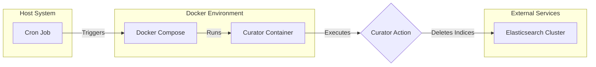

# Elasticsearch Curator for Automated Log Rotation

This project provides a streamlined solution for automating Elasticsearch log rotation using Docker and cron. It is designed to periodically delete old indices from an Elasticsearch cluster, helping to manage storage space and maintain performance. The core component is `elasticsearch-curator`, which is configured to run within a Docker container and triggered by a system cron job.

## Table of Contents

- [Overview](#overview)
- [Architecture](#architecture)
- [Workflow](#workflow)
- [Prerequisites](#prerequisites)
- [Configuration](#configuration)
- [Usage](#usage)
- [Logging](#logging)

## Overview

The primary goal of this project is to automate the deletion of Elasticsearch indices that are older than a specified retention period. This is particularly useful in environments where logs are continuously generated, such as those using the EFK (Elasticsearch, Fluentd, Kibana) stack for log aggregation. By containerizing the `elasticsearch-curator` tool, the solution remains portable and isolated from the host system's dependencies.

## Architecture

The system is composed of three main components:
1.  **Docker**: Containerizes the `elasticsearch-curator` tool and its Python environment.
2.  **Docker Compose**: Simplifies the management of the Curator Docker container.
3.  **Cron Job**: Schedules the execution of the Curator service at regular intervals.

The following diagram illustrates the architectural workflow:



## Workflow

1.  A cron job on the host system is scheduled to run at a specified interval (e.g., daily).
2.  When triggered, the cron job executes `docker-compose up`, which starts the `curator` service defined in `docker-compose.yaml`.
3.  Docker Compose builds or pulls the `elasticsearch-curator` image and runs a new container.
4.  Inside the container, the `curator` command is executed with the configurations specified in `curator.yaml` and `action.yaml`.
5.  The Curator connects to the Elasticsearch cluster and applies the defined action, which deletes indices older than 7 days that match the specified regex pattern.
6.  The output of the Curator process, including any actions taken or errors encountered, is logged to `curator.log`.
7.  Once the command completes, the container stops, and the process is complete until the next scheduled cron run.

## Prerequisites

- Docker and Docker Compose installed on the host system.
- Access to an Elasticsearch cluster.
- A user with the necessary permissions to delete indices.

## Configuration

The behavior of the Curator is controlled by two YAML files:

### `curator.yaml`

This file contains the connection settings for your Elasticsearch cluster. You must update the following fields with your cluster's details:

-   `hosts`: The URL and port of your Elasticsearch instance (e.g., `http://localhost:9200`).
-   `username`: The username for authentication.
-   `password`: The password for authentication.

### `action.yaml`

This file defines the actions that the Curator will perform. The default configuration is set to:

-   **Action**: `delete_indices`
-   **Filter**: Deletes indices where the name contains "kube" or "service" and is older than 7 days, based on the `YYYY.MM.DD` date format in the index name.

You can customize the `value` regex and `unit_count` to match your specific index naming conventions and retention policies.

## Usage

1.  **Build the Docker Image**:
    ```sh
    docker build -t elasticsearch-curator:latest .
    ```

2.  **Configure the Cron Job**:
    Add the following line to your crontab to run the Curator daily at midnight:
    ```crontab
    0 0 * * * cd /path/to/your/project && /usr/local/bin/docker-compose up >> /dev/null 2>&1
    ```
    *Note: Ensure you provide the absolute path to your project directory and the `docker-compose` executable.*

3.  **Run Manually**:
    To trigger the Curator process manually, navigate to the project directory and run:
    ```sh
    docker-compose up
    ```

## Logging

All actions performed by the Curator are logged to `curator.log`. This file provides a detailed record of which indices were deleted and when, making it easy to monitor the system's activity and troubleshoot any issues.